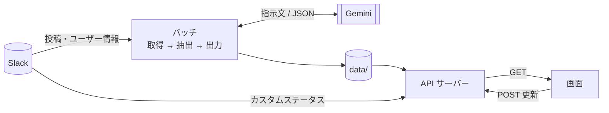

# verbinden-slack-extractor

Slack の投稿から「イベント一覧」と「メンバープロフィール」を AI（Gemini）で作り、HTTP API で画面に渡すサーバーです。工科展の作品「フェアビンデン」の一部として作りました。

- イベント：指定チャンネル（例 `#general`）の告知から、日時・場所つきのイベントを取り出す
- メンバー：各自の times チャンネルから紹介文を作り、Slack のアイコン・名前・カスタムステータスと合わせて返す
- 画面から「更新」を呼ぶと、Slack を読み直して作り直す（10分に1回まで）
- Slack には書き込まない（読み取りだけ）

---

## 1. 3分で動かす

Python 3.11 以上が必要です。macOS か Linux で、このリポジトリのフォルダの中で実行します。

```sh
python3.12 -m venv .venv
.venv/bin/python -m pip install -e '.[test]'
cp .env.example .env.test          # 作ったら SLACK_BOT_TOKEN と GEMINI_API_KEY を書く
.venv/bin/python -m verbinden.batch --env test                     # Slack を読んで data/out/test/ を作る
VERBINDEN_ENV=test .venv/bin/python -m uvicorn verbinden.api:app --host 0.0.0.0 --port 8000
```

ブラウザで `http://localhost:8000/docs` を開くと、API の一覧をその場で試せます。

---

## 2. API 早見表（画面を作る人向け）

すべてのレスポンスは `{"success": true/false, "data": ..., "error": null または文字列}` の形です。

| やりたいこと | 呼び方 | data の中身 |
|---|---|---|
| メンバー一覧を表示する | `GET /api/members` | `[{id, name, iconUrl, status: {emoji, text, presence}, intro}]` |
| イベント一覧を表示する | `GET /api/events` | `[{id, summary, location?, description, start, end}]`（開始日時順） |
| イベントを作り直す | `POST /api/refresh/events` | 受け付けたら 202。作り直しは裏で進む |
| プロフィールを作り直す | `POST /api/refresh/members` | 同上 |
| 作り直しが終わったか見る | `GET /api/refresh/status` | `{events: {state, ...}, members: {state, ...}}` |
| 動いているか確かめる | `GET /api/health` | `{env: "test"}` |

更新の流れは「POST → status を2秒おきに見る → `succeeded` になったら GET し直す」です。1回は数秒〜数十秒で終わります。

レスポンスの例（値は架空）:

```json
// GET /api/members の data[0]
{ "id": "mem-U0000001", "name": "テスト太郎", "iconUrl": "https://...",
  "status": { "emoji": "💻", "text": "作業中", "presence": "active" },
  "intro": "ゲームと音楽が好きで、最近は Slack の bot を作っている。" }

// GET /api/events の data[0]（時刻あり）
{ "id": "slk17283000001234", "summary": "LT会", "location": "部室",
  "description": "1人5分、テーマ自由\n（Slack #general の投稿より）",
  "start": { "dateTime": "2026-10-15T18:00:00+09:00", "timeZone": "Asia/Tokyo" },
  "end":   { "dateTime": "2026-10-15T19:30:00+09:00", "timeZone": "Asia/Tokyo" } }

// 終日イベントは date を使う。end は最終日の翌日（10/8〜10/11 の場合）
{ "id": "slk17283000005678", "summary": "工科展",
  "start": { "date": "2026-10-08" }, "end": { "date": "2026-10-12" }, "description": "..." }
```

画面側で押さえておくこと:

- イベントは `id` で見分ける。件名（summary）は AI が書くので、更新のたびに言い回しが変わることがある。`id` は同じ投稿なら変わらない
- イベントの形は Google Calendar API の Event 形式に合わせてある。FullCalendar などのカレンダー部品にほぼそのまま渡せる。`location` は場所が分からないときキーごとない
- `status.emoji` / `status.text` は本人が Slack にカスタムステータスを設定していなければ null。そのときは `presence`（`active` / `away`）で「オンライン／離席」を出すとよい
- `iconUrl` と `intro` は null のことがある
- 更新の POST は 202 / 409（実行中）/ 429（10分以内。`Retry-After` ヘッダーで残り秒数）を返す。詳しくは §6.2

ブラウザからの更新の例:

```js
const apiBase = "http://APIのPCのアドレス:8000";

async function refresh(target) {            // target は "events" か "members"
  const res = await fetch(`${apiBase}/api/refresh/${target}`, { method: "POST" });
  const body = await res.json();
  if (res.status === 429) return `あと${res.headers.get("Retry-After")}秒待ってください`;
  if (res.status !== 202) return body.error;
  for (;;) {
    await new Promise((r) => setTimeout(r, 2000));
    const status = (await (await fetch(`${apiBase}/api/refresh/status`)).json()).data[target];
    if (status.state === "running") continue;
    if (status.state !== "succeeded") return status.message;   // 失敗しても前のデータは残る
    return (await (await fetch(`${apiBase}/api/${target}`)).json()).data;
  }
}
```

画面の Origin（例 `http://192.168.0.10:3000`）は、サーバー側の `config/config.{env}.yaml` の `api.corsOrigins` に登録されている必要があります。登録されていないとブラウザが通信を止めます。

動作確認用の簡単な画面が `preview/index.html` にあります（`python -m http.server 3000 --directory preview` で開く。API の場所はファイル内の `API_BASE`）。

---

## 3. 動かす環境を用意する人向け

### 3.1 必要なもの

| 項目 | 内容 |
|---|---|
| OS | macOS か Linux（ロックに `fcntl` を使うので Windows は不可。WSL なら可） |
| Python | 3.11 以上（開発では 3.12.15 を使用） |
| ネットワーク | 外向きに Slack（slack.com）と Gemini（generativelanguage.googleapis.com）へ HTTPS でつながること |
| ポート | API を受ける TCP 8000（変更可） |
| 書き込み先 | `data/`（取得した投稿と結果を保存する。消えると作り直しが必要） |
| プロセス数 | API は1プロセスで動かす（更新の状態と10分制限をメモリに持つため。`--workers` を増やさない） |

### 3.2 設定は3か所

| 場所 | 何を書くか | 例 |
|---|---|---|
| `.env.{env}`（Git に入れない） | 秘密情報 | `SLACK_BOT_TOKEN=xoxb-...`、`GEMINI_API_KEY=...` |
| `config/config.{env}.yaml` | 動き方の設定（チャンネル名、AI のモデル、画面の Origin など） | §6.3 に全項目 |
| 環境変数 `VERBINDEN_ENV` | API がどちらの設定を使うか | `test` または `prod` |

`{env}` は `test` か `prod` です。バッチは `--env`、API は `VERBINDEN_ENV` で選びます。

秘密情報は `.env.{env}` の代わりに環境変数で渡しても動きます。`.env.{env}` にあるキーはそちらが優先され、`.env.{env}` にない・空のキーだけ環境変数を使います。

### 3.3 インストールの注意

設定ファイルと `data/` の場所は「パッケージのフォルダの2つ上（このリポジトリの直下）」として探します。そのため、必ずリポジトリを丸ごと置いて `pip install -e .`（編集可能インストール）で入れてください。`pip install .` で site-packages に入れると、`config/` が見つからずに起動しません。

### 3.4 Docker で動かす例（未検証）

開発では Docker を使っていないので、次は動作を確かめていない例です。

```dockerfile
# Dockerfile
FROM python:3.12-slim
WORKDIR /app
COPY . .
RUN pip install --no-cache-dir -e .
ENV VERBINDEN_ENV=test
EXPOSE 8000
CMD ["uvicorn", "verbinden.api:app", "--host", "0.0.0.0", "--port", "8000"]
```

```
# .dockerignore（秘密情報と取得データをイメージに入れない）
.env
.env.*
!.env.example
data/
.venv/
```

```sh
docker build -t verbinden-api .
# 秘密情報と data は外から渡す（イメージに入れない）
docker run --rm -p 8000:8000 \
  -v "$PWD/.env.test:/app/.env.test:ro" -v "$PWD/data:/app/data" verbinden-api
# バッチは同じイメージで1回だけ動かす
docker run --rm -v "$PWD/.env.test:/app/.env.test:ro" -v "$PWD/data:/app/data" \
  verbinden-api python -m verbinden.batch --env test
```

コンテナの中では `--host 0.0.0.0` が必須です。`data/` は API とバッチで同じものを共有してください（ロックファイル `data/{env}/.batch.lock` もここに置かれます）。

### 3.5 別の PC の画面から呼ぶとき

- API は `--host 0.0.0.0` で起動する（`127.0.0.1` だとその PC からしか呼べない）
- 画面からは `http://APIのPCのLANアドレス:8000` を呼ぶ
- OS のファイアウォールで TCP 8000 を許可する
- 画面の Origin を `api.corsOrigins` に書き、API を起動し直す（設定は起動時に読む）

---

## 4. プログラムの地図（直す人向け）

`src/verbinden/` の中身です。「純粋」は入力から出力を計算するだけのファイルで、Slack・AI・ファイルを触りません。単体テストがしやすいので、規則を変えるときはまずここを見ます。

| ファイル | 種類 | 役割 |
|---|---|---|
| `batch.py` | 入口 | バッチ本体（`python -m verbinden.batch`）。取得 → 抽出 → 出力の流れと、更新 API から呼ばれる `refresh_events` / `refresh_members` |
| `api.py` | 入口 | FastAPI のサーバー。エンドポイントと CORS |
| `refresh.py` | 外側 | 更新 API の受付、10分制限、実行中の判定、状態の管理 |
| `batch_lock.py` | 外側 | バッチと更新が同時に動かないようにするロック |
| `config.py` | 外側 | `config/*.yaml` と `.env.*` の読み込みと検証 |
| `slack_gateway.py` | 外側 | Slack API の呼び出し。カスタムステータスのキャッシュ（60秒） |
| `llm/` | 外側 | AI の呼び出し。`gemini.py`・`ollama.py`・テスト用の `fake.py` を同じ形で差し替える |
| `storage.py` | 外側 | `data/` への保存と読み込み（書きかけを読まないよう置き換え方式） |
| `models.py` | 純粋 | データの型（Post・Event・Profile など）と守るべき条件 |
| `normalize.py` | 純粋 | Slack の生データを扱いやすい形に変える。Bot や参加通知を除く |
| `prompts.py` | 純粋 | AI に送る指示文を組み立てる |
| `validate.py` | 純粋 | AI の返答を検証し、おかしいものを捨てる |
| `calendar_format.py` | 純粋 | イベントをカレンダー用の形（start/end）に変える |
| `stats.py` | 純粋 | 時間帯ごとの投稿数を数える |
| `present.py` | 純粋 | API で返す1人分の形を組み立てる |

### よくある変更と、直す場所

| やりたいこと | 直す場所 |
|---|---|
| 読むチャンネルを変える | `config/config.{env}.yaml` の `slack.eventChannel` / `slack.timesChannels` |
| AI のモデルを変える | 同 `llm.model`（Ollama にするなら `llm.provider: ollama`） |
| 更新の間隔（10分）を変える | 同 `api.refreshCooldownSeconds`（秒） |
| 画面に返すメンバーの項目・キー名を変える | 同 `output.members`（使える項目は `config.py` の `allowed`） |
| 紹介文の書き方・イベントの拾い方を変える | `prompts.py` |
| 捨てる条件（文字数、重複の扱いなど）を変える | `validate.py`（上限は `models.py`） |
| カレンダーの形を変える（終了時刻がないときの長さなど） | `calendar_format.py` |
| メンバーに新しい項目を足す | `models.py`（Profile）→ `prompts.py` → `validate.py` → `present.py` → `config.py` の `allowed` |
| 新しいエンドポイントを足す | `api.py` |

変えたら `.venv/bin/python -m pytest` を実行してください。テストは本物の Slack・Gemini を呼びません。

---

## 5. 処理の流れ



| 段階 | やること | 保存先 |
|---|---|---|
| 取得（fetch） | 直近30日の親投稿を読む（スレッドの返信は読まない） | `data/raw/{env}/{日時}/` |
| 抽出（extract） | 整形 → AI でイベントと紹介文を作る → 検証 | `data/extracted/{env}/` |
| 出力（output） | イベントをカレンダー用の形にする | `data/out/{env}/`（API はここだけ読む） |

API はリクエストのたびに `data/out/{env}/` を読み、メンバーには Slack から取り直したカスタムステータスを足して返します。

---

## 6. 詳細

### 6.1 バッチのコマンド

```sh
.venv/bin/python -m verbinden.batch --env test                       # 最初から全部
.venv/bin/python -m verbinden.batch --env test --from-stage extract  # 保存済みの raw から（Slack の履歴は読み直さない。AI は呼ぶ）
.venv/bin/python -m verbinden.batch --env test --from-stage output   # 保存済みの抽出結果から出力だけ（Slack も AI も呼ばない）
```

`output.members` を変えたときは `--from-stage output` で作り直し、API を起動し直します。

### 6.2 更新 API

| 返り値 | 意味 | 画面での扱い |
|---|---|---|
| 202 | 受け付けた（終わったわけではない） | status を見て待つ |
| 409 | 同じ種類が実行中、または反対の種類・手動のバッチが実行中 | 少し待って押し直してもらう |
| 429 | 前回の受付から10分たっていない | `Retry-After`（秒）か `data.nextAvailableAt` まで待つ |
| 503 | 内部の失敗（ロックが取れないなど） | サーバー担当に連絡 |

- 10分はイベントとプロフィールで別々に数える。失敗した回も1回と数える
- 失敗しても、保存済みのデータは前のまま残り、GET はそれを返し続ける
- status の `state` は `idle`（起動後まだ更新していない）/ `running` / `succeeded` / `failed`
- 状態と10分制限はメモリに持つ。API を起動し直すとリセットされる
- 認証はない。同じネットワークの誰でも呼べるので、10分の制限で AI の無料枠を守っている

### 6.3 設定の全項目（`config/config.{env}.yaml`）

| 項目 | 例 | 意味 |
|---|---|---|
| `env` | `test` | ファイル名と一致させる |
| `slack.eventChannel` | `general` | イベントを探すチャンネル（`#` なし。公開チャンネルだけ） |
| `slack.timesChannels` | `[{channel: times-taro, owner: null}]` | プロフィールを作るチャンネル。`owner` が null ならチャンネルを作った人を持ち主とする |
| `slack.periodDays` | `30` | 読む期間（日） |
| `llm.provider` | `gemini` | `gemini` / `ollama` / `fake`（テスト用） |
| `llm.model` | `gemini-flash-lite-latest` | モデル名 |
| `llm.maxRetries` / `llm.timeoutSeconds` | `3` / `60` | AI の再試行回数（2・4・8秒あけて）とタイムアウト |
| `api.statusCacheSeconds` | `60` | カスタムステータスを使い回す秒数 |
| `api.refreshCooldownSeconds` | `600` | 更新を受け付ける間隔（秒） |
| `api.corsOrigins` | `[http://localhost:3000]` | 画面の Origin（パスは書かない） |
| `output.members` | `{id: id, name: name, iconUrl: iconUrl, status: status, intro: intro}` | 返す項目と、返すときのキー名。消した項目は返らない |
| `paths.dataDir` | `data` | 保存先（リポジトリ直下からの相対パス） |

設定に間違いがあると、起動時に「どの項目がなぜ違うか」を表示して止まります。

`.env.{env}` のキー:

| キー | 必須 | 内容 |
|---|---|---|
| `SLACK_BOT_TOKEN` | 必須 | Slack の Bot トークン（`xoxb-`） |
| `GEMINI_API_KEY` | `llm.provider: gemini` のとき | Gemini の API キー |
| `OLLAMA_BASE_URL` | 任意 | Ollama の接続先（既定 `http://localhost:11434`） |

### 6.4 Slack App の準備

Bot Token Scopes に `channels:history`・`channels:read`・`users:read` の3つを付けてワークスペースにインストールし、Bot を対象のチャンネルに `/invite` します。Socket Mode やイベントの購読（Event Subscriptions）は使いません。

### 6.5 処理の規則

- 画像・ファイルの中身は読まない。画像付き投稿の本文は使う
- 日付の分からない告知はイベントにしない。「来週水曜」「明日」は投稿日を基準に日付へ直す
- AI が返したイベントのうち、元の投稿が見つからないものは捨てる（AI の作り話を防ぐ）
- 件名と日付が同じイベントは1件にまとめる（リマインド投稿の重複）
- times は持ち主の投稿だけを使う。友人の投稿、スレッドの返信、スタンプは使わない。同じ人の times が複数あれば1人分にまとめる
- 友人へのメンションは AI に送る前に `@メンバー` に置き換える
- 紹介文は80文字以内。住所・連絡先・健康・家族・他人の話は書かないよう AI に指示している（完全な匿名化ではない）

### 6.6 保存されるデータ

| 場所 | 中身 |
|---|---|
| `data/raw/{env}/{日時}/` | Slack から取った投稿（手動のバッチ） |
| `data/raw/{env}/{日時}-events/`、`-members/` | 更新 API で取った投稿 |
| `data/extracted/{env}/` | AI で作ったイベント・プロフィール |
| `data/out/{env}/` | API が返すデータ |
| `data/{env}/.batch.lock` | 同時実行を防ぐロック。残っていて正常。動作中に消さない |

`data/` には投稿の本文が入るので、公開しないでください（`.gitignore` で除外済み）。

### 6.7 テスト

```sh
.venv/bin/python -m pytest --cov=verbinden --cov-report=term-missing
```

偽の Slack と偽の AI を使うので、トークンなしで動きます。カバレッジが80%を下回ると失敗します。

### 6.8 困ったとき

| 症状 | 確かめること |
|---|---|
| 起動しない | 表示されたエラーの項目、`.env.{env}` のキー、`VERBINDEN_ENV`、`pip install -e .` で入れたか |
| `channel_not_found` / `not_in_channel` | チャンネル名、Bot を招待したか、3つの権限 |
| `/api/members` などが 503 | 同じ環境でバッチを一度実行したか |
| 別の PC からつながらない | `--host 0.0.0.0`、LAN アドレス、ポート、ファイアウォール |
| ブラウザだけつながらない | 画面の Origin が `api.corsOrigins` にあるか、API を起動し直したか |
| ステータスが出ない | 本人がカスタムステータスを設定しているか。最大60秒は前の値 |
| 更新が 429 | 10分待つ（API を起動し直すとリセットされる） |
| AI が 404 / 503 | モデル名が使えるか（提供が終わることがある）。503 は混雑なので時間をおく |

### 6.9 AI に送る内容について

Gemini API の無料枠では、送った内容が Google の製品改善に使われ、人が確認する場合があります（[Gemini API 利用規約](https://ai.google.dev/gemini-api/terms)）。実在の人の投稿を送る場合は、Slack の管理者と相談するか、`llm.provider: ollama` で手元の AI を使ってください。
